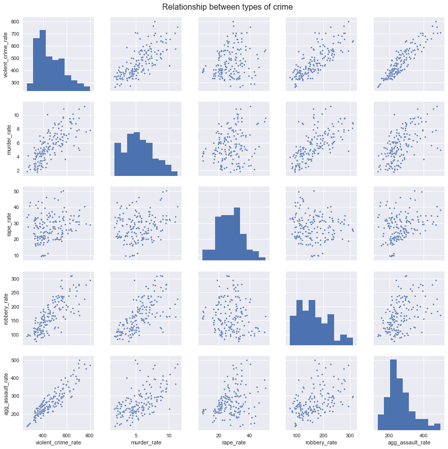
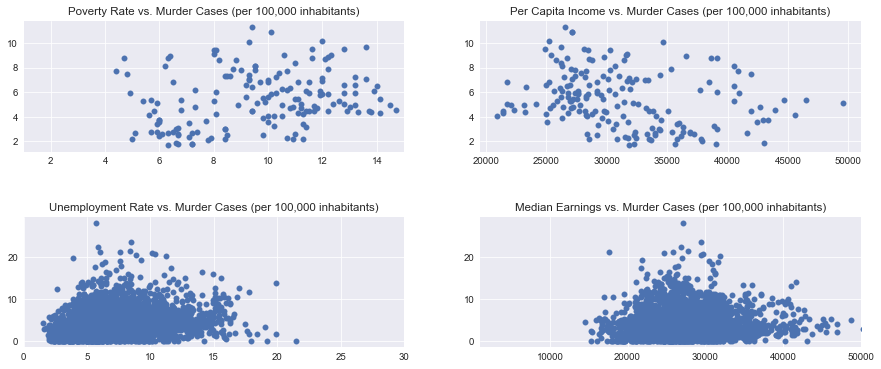

nav_include: 1

```python
import numpy as np
import pandas as pd
from sklearn.preprocessing import PolynomialFeatures
from sklearn.neighbors import KNeighborsRegressor as KNN
from sklearn.linear_model import RidgeCV
from sklearn.linear_model import Ridge
from sklearn.linear_model import LinearRegression as Linear
from sklearn.linear_model import LogisticRegressionCV
from sklearn.preprocessing import PolynomialFeatures
from sklearn.preprocessing import Imputer
from sklearn.discriminant_analysis import LinearDiscriminantAnalysis
from sklearn.discriminant_analysis import QuadraticDiscriminantAnalysis
from sklearn.neighbors import KNeighborsClassifier
from sklearn.tree import DecisionTreeClassifier
from sklearn.model_selection import cross_val_score
import sklearn.metrics as metrics
from sklearn.metrics import accuracy_score
from sklearn.metrics import confusion_matrix
from sklearn.metrics import mean_squared_error
from sklearn.metrics import classification_report
from sklearn.metrics import r2_score
from scipy import stats
from bs4 import BeautifulSoup
import urllib
import sys
import seaborn as sns
import matplotlib
import matplotlib.pyplot as plt
import matplotlib.cm as cmx
import matplotlib.colors as colors
import matplotlib.patches as patches
import requests 
%matplotlib inline

import warnings
warnings.filterwarnings("ignore")

sns.set_palette("Blues_d")

```


```python
df = pd.read_excel('Census_2/2_Clean_Data/Crime_Census_Merged_Imputed_No_Dummies.xlsx')
```


```python
df.msa_id[df.msa_id== 31080] = 31100 
df['All families - Percent below poverty level; Families'][df['All families - Percent below poverty level; Families']< 0] = 0 
df['Employed; EDUCATIONAL ATTAINMENT - Population 25 to 64 years'][df['Employed; EDUCATIONAL ATTAINMENT - Population 25 to 64 years']< 0] = 0 
df['Total; Median earnings (dollars)'][df['Total; Median earnings (dollars)']< 0] = 0 

```


```python

```


```python
print(df.shape)
df.head()
```


    (3669, 324)


<div>
<style>
    .dataframe thead tr:only-child th {
        text-align: right;
    }

    .dataframe thead th {
        text-align: left;
    }

    .dataframe tbody tr th {
        vertical-align: top;
    }
</style>
<table border="1" class="dataframe">
  <thead>
    <tr style="text-align: right;">
      <th></th>
      <th>msa_name</th>
      <th>msa_name.1</th>
      <th>msa_name.2</th>
      <th>msa_id</th>
      <th>msa_id.1</th>
      <th>year</th>
      <th>year.1</th>
      <th>tot_pop</th>
      <th>All families - Percent below poverty level; Families</th>
      <th>All families - Total; Families</th>
      <th>...</th>
      <th>Widowed; Population 15 years and over</th>
      <th>rep_violent_crime</th>
      <th>rep_murder</th>
      <th>rep_rape</th>
      <th>rep_robbery</th>
      <th>rep_agg_assault</th>
      <th>rep_pro_crime</th>
      <th>rep_burglary</th>
      <th>rep_theft</th>
      <th>rep_veh_theft</th>
    </tr>
  </thead>
  <tbody>
    <tr>
      <th>0</th>
      <td>Abilene, TX</td>
      <td>Abilene, TX</td>
      <td>Abilene, TX</td>
      <td>10180.0</td>
      <td>10180.0</td>
      <td>2016.0</td>
      <td>2016.0</td>
      <td>169885.0</td>
      <td>10.900000</td>
      <td>38610.0</td>
      <td>...</td>
      <td>5.5</td>
      <td>614.0</td>
      <td>11.0</td>
      <td>79.0</td>
      <td>137.0</td>
      <td>387.0</td>
      <td>4932.0</td>
      <td>1104.0</td>
      <td>530.0</td>
      <td>298.0</td>
    </tr>
    <tr>
      <th>1</th>
      <td>Abilene, TX</td>
      <td>Abilene, TX</td>
      <td>Abilene, TX</td>
      <td>10180.0</td>
      <td>10180.0</td>
      <td>2015.0</td>
      <td>2015.0</td>
      <td>169713.0</td>
      <td>9.900000</td>
      <td>37669.0</td>
      <td>...</td>
      <td>6.6</td>
      <td>700.0</td>
      <td>9.0</td>
      <td>95.0</td>
      <td>133.0</td>
      <td>463.0</td>
      <td>6125.0</td>
      <td>1446.0</td>
      <td>232.0</td>
      <td>447.0</td>
    </tr>
    <tr>
      <th>2</th>
      <td>Abilene, TX</td>
      <td>Abilene, TX</td>
      <td>Abilene, TX</td>
      <td>10180.0</td>
      <td>10180.0</td>
      <td>2014.0</td>
      <td>2014.0</td>
      <td>169202.0</td>
      <td>12.700000</td>
      <td>41437.0</td>
      <td>...</td>
      <td>5.4</td>
      <td>677.0</td>
      <td>10.0</td>
      <td>113.0</td>
      <td>140.0</td>
      <td>414.0</td>
      <td>6207.0</td>
      <td>1428.0</td>
      <td>372.0</td>
      <td>407.0</td>
    </tr>
    <tr>
      <th>3</th>
      <td>Abilene, TX</td>
      <td>Abilene, TX</td>
      <td>Abilene, TX</td>
      <td>10180.0</td>
      <td>10180.0</td>
      <td>2013.0</td>
      <td>2013.0</td>
      <td>168117.0</td>
      <td>11.500000</td>
      <td>39532.0</td>
      <td>...</td>
      <td>5.6</td>
      <td>560.0</td>
      <td>1.0</td>
      <td>43.0</td>
      <td>128.0</td>
      <td>388.0</td>
      <td>5522.0</td>
      <td>1323.0</td>
      <td>907.0</td>
      <td>292.0</td>
    </tr>
    <tr>
      <th>4</th>
      <td>Abilene, TX</td>
      <td>Abilene, TX</td>
      <td>Abilene, TX</td>
      <td>10180.0</td>
      <td>10180.0</td>
      <td>2012.0</td>
      <td>2012.0</td>
      <td>168908.0</td>
      <td>11.236424</td>
      <td>39268.0</td>
      <td>...</td>
      <td>6.8</td>
      <td>555.0</td>
      <td>3.0</td>
      <td>45.0</td>
      <td>136.0</td>
      <td>371.0</td>
      <td>5080.0</td>
      <td>1245.0</td>
      <td>631.0</td>
      <td>204.0</td>
    </tr>
  </tbody>
</table>
<p>5 rows × 324 columns</p>
</div>


```python
df_small = df[df['msa_id'].isin(df.loc[df['tot_pop'] > 3000000, 'msa_id'])]
df_small[['tot_pop', 'msa_name', 'msa_id', 'year']].head()

```


<div>
<style>
    .dataframe thead tr:only-child th {
        text-align: right;
    }

    .dataframe thead th {
        text-align: left;
    }

    .dataframe tbody tr th {
        vertical-align: top;
    }
</style>
<table border="1" class="dataframe">
  <thead>
    <tr style="text-align: right;">
      <th></th>
      <th>tot_pop</th>
      <th>msa_name</th>
      <th>msa_id</th>
      <th>year</th>
    </tr>
  </thead>
  <tbody>
    <tr>
      <th>168</th>
      <td>5790619.0</td>
      <td>Atlanta-Sandy Springs-Roswell, GA</td>
      <td>12060.0</td>
      <td>2016.0</td>
    </tr>
    <tr>
      <th>169</th>
      <td>5704839.0</td>
      <td>Atlanta-Sandy Springs-Roswell, GA</td>
      <td>12060.0</td>
      <td>2015.0</td>
    </tr>
    <tr>
      <th>170</th>
      <td>5597635.0</td>
      <td>Atlanta-Sandy Springs-Roswell, GA</td>
      <td>12060.0</td>
      <td>2014.0</td>
    </tr>
    <tr>
      <th>171</th>
      <td>5511212.0</td>
      <td>Atlanta-Sandy Springs-Roswell, GA</td>
      <td>12060.0</td>
      <td>2013.0</td>
    </tr>
    <tr>
      <th>172</th>
      <td>5434540.0</td>
      <td>Atlanta-Sandy Springs-Marietta, GA</td>
      <td>12060.0</td>
      <td>2012.0</td>
    </tr>
  </tbody>
</table>
</div>


```python

```


```python
labels = ['Atlanta-Sandy Springs-Marietta', 'Boston-Cambridge-Newton', 'Chicago-Naperville-Elgin', 'Dallas-Fort Worth-Arlington', 'Detroit-Warren-Livonia','Houston-Sugar Land-Baytown','Los Angeles-Long Beach-Anaheim','Miami-Fort Lauderdale-Miami Beach','Minneapolis-St. Paul-Bloomington','New York-Newark-Jersey City','Philadelphia-Camden-Wilmington','Phoenix-Mesa-Scottsdale','Riverside-San Bernardino-Ontario','San Diego-Carlsbad-San Marcos','San Francisco-Oakland-Fremont','Seattle-Tacoma-Bellevue','Tampa-St. Petersburg-Clearwater','Washington-Arlington-Alexandria']
labels_alt = ['Atlanta', 'Boston', 'Chicago', 'Dallas', 'Detroit','Houston','Los Angeles','Miami','Minneapolis','New York','Philadelphia','Phoenix','Riverside','San Diego','San Francisco','Seattle','Tampa','Washington']

fig, ax = plt.subplots(figsize=(16,8), facecolor='w', edgecolor='k', sharey=False)

population = df_small.groupby("msa_id")["tot_pop"].mean()
population.sort_index().plot(kind = 'bar', figsize=(14,5), ax=ax)
plt.xlabel("City", fontsize=18)
plt.ylabel("Population", fontsize=18)
ax.set_title("Average Population (in 10,000,000), 2006-2016",size=20)
ax.set_xticklabels(labels_alt, rotation=45, size=16)
plt.rc('xtick',labelsize=10)
plt.rc('ytick',labelsize=10)
```


```python
df_small_2016= df_small[df_small['year'] == 2016]
df_small_2016.shape
```


    (18, 324)


```python

fig, ax = plt.subplots(figsize=(16,8), facecolor='w', edgecolor='k', sharey=False)

sns.barplot(x="msa_id", y="tot_pop", data=df_small_2016, palette="Blues_d", ax=ax).set_title("Total Population in 2016 (in 10,000,000)")
ax.set_xticklabels(ax.get_xticklabels(), rotation=90, size=12)

plt.xlabel('MSA', fontsize=18)
plt.ylabel('Murder Rate', fontsize=18)

ax.set_title("Total Population in 2016 (in 10,000,000)", fontsize=20)
ax.set_xticklabels(labels_alt, rotation=45, size=16)

```


    [<matplotlib.text.Text at 0x125db1fd0>,
     <matplotlib.text.Text at 0x125ddfd68>,
     <matplotlib.text.Text at 0x1256c2da0>,
     <matplotlib.text.Text at 0x125d15d68>,
     <matplotlib.text.Text at 0x11e298f98>,
     <matplotlib.text.Text at 0x125f09828>,
     <matplotlib.text.Text at 0x125f1d6d8>,
     <matplotlib.text.Text at 0x125f285c0>,
     <matplotlib.text.Text at 0x125dd6d68>,
     <matplotlib.text.Text at 0x125dd6cc0>,
     <matplotlib.text.Text at 0x13206a0f0>,
     <matplotlib.text.Text at 0x12edf3978>,
     <matplotlib.text.Text at 0x125df63c8>,
     <matplotlib.text.Text at 0x11de2ce10>,
     <matplotlib.text.Text at 0x11de2ccf8>,
     <matplotlib.text.Text at 0x11dd8d2e8>,
     <matplotlib.text.Text at 0x125d24320>,
     <matplotlib.text.Text at 0x125d24dd8>]


```python
sns.set_context()

fig, ax = plt.subplots(figsize=(16,8), facecolor='w', edgecolor='k', sharey=False)

sns.barplot(x="msa_id", y="tot_pop", data=df_small, palette="Blues_d", ax=ax).set_title("Average Population(in 10,000,000), 2006-2016")
#ax.set_xticklabels(ax.get_xticklabels(), rotation=90, size=12)

plt.xlabel('MSA', fontsize=18)
plt.ylabel('Murder Rate', fontsize=18)
ax.set_title("Average Population(in 10,000,000), 2006-2016", fontsize=20)

labels = ['Atlanta-Sandy Springs-Marietta', 'Boston-Cambridge-Newton', 'Chicago-Naperville-Elgin', 'Dallas-Fort Worth-Arlington', 'Detroit-Warren-Livonia','Houston-Sugar Land-Baytown','Los Angeles-Long Beach-Anaheim','Miami-Fort Lauderdale-Miami Beach','Minneapolis-St. Paul-Bloomington','New York-Newark-Jersey City','Philadelphia-Camden-Wilmington','Phoenix-Mesa-Scottsdale','Riverside-San Bernardino-Ontario','San Diego-Carlsbad-San Marcos','San Francisco-Oakland-Fremont','Seattle-Tacoma-Bellevue','Tampa-St. Petersburg-Clearwater','Washington-Arlington-Alexandria']
ax.set_xticklabels(labels_alt, rotation=45, size=16)

```


    [<matplotlib.text.Text at 0x11e421160>,
     <matplotlib.text.Text at 0x11e417278>,
     <matplotlib.text.Text at 0x1236c6c18>,
     <matplotlib.text.Text at 0x1236da710>,
     <matplotlib.text.Text at 0x1236b1208>,
     <matplotlib.text.Text at 0x1236b1cc0>,
     <matplotlib.text.Text at 0x1321457b8>,
     <matplotlib.text.Text at 0x1321322b0>,
     <matplotlib.text.Text at 0x132132d68>,
     <matplotlib.text.Text at 0x132146860>,
     <matplotlib.text.Text at 0x132110358>,
     <matplotlib.text.Text at 0x132110e10>,
     <matplotlib.text.Text at 0x13211e908>,
     <matplotlib.text.Text at 0x132143400>,
     <matplotlib.text.Text at 0x132143eb8>,
     <matplotlib.text.Text at 0x1321349b0>,
     <matplotlib.text.Text at 0x1321134a8>,
     <matplotlib.text.Text at 0x132113f60>]


```python
df["violent_crime_rate"] = (df["rep_violent_crime"]/df["tot_pop"])*100000
df["murder_rate"] = (df["rep_murder"]/df["tot_pop"])*100000
df["rape_rate"] = (df["rep_rape"]/df["tot_pop"])*100000
df["robbery_rate"] = (df["rep_robbery"]/df["tot_pop"])*100000
df["agg_assault_rate"] = (df["rep_agg_assault"]/df["tot_pop"])*100000

df_small["violent_crime_rate"] = (df_small["rep_violent_crime"]/df_small["tot_pop"])*100000
df_small["murder_rate"] = (df_small["rep_murder"]/df_small["tot_pop"])*100000
df_small["rape_rate"] = (df_small["rep_rape"]/df_small["tot_pop"])*100000
df_small["robbery_rate"] = (df_small["rep_robbery"]/df_small["tot_pop"])*100000
df_small["agg_assault_rate"] = (df_small["rep_agg_assault"]/df_small["tot_pop"])*100000

df_small_2016["violent_crime_rate"] = (df_small_2016["rep_violent_crime"]/df_small_2016["tot_pop"])*100000
df_small_2016["murder_rate"] = (df_small_2016["rep_murder"]/df_small_2016["tot_pop"])*100000
df_small_2016["rape_rate"] = (df_small_2016["rep_rape"]/df_small_2016["tot_pop"])*100000
df_small_2016["robbery_rate"] = (df_small_2016["rep_robbery"]/df_small_2016["tot_pop"])*100000
df_small_2016["agg_assault_rate"] = (df_small_2016["rep_agg_assault"]/df_small_2016["tot_pop"])*100000

```


```python
df['high_murder'] = np.where(df['murder_rate']>=10, 1, 0)
df_small['high_murder'] = np.where(df_small['murder_rate']>=10, 1, 0)
df_small_2016['high_murder'] = np.where(df_small_2016['murder_rate']>=10, 1, 0)

```


```python
fig, ax = plt.subplots(figsize=(16,8), facecolor='w', edgecolor='k')

sns.barplot(x="msa_id", y="murder_rate", data=df_small_2016, palette="Blues_d", ax=ax).set_title("No. of Murders (per 100,000 citizens) in 2016")

ax.set_xticklabels(ax.get_xticklabels(), rotation=90, size=12)
plt.xlabel('MSA', fontsize=18)
plt.ylabel('Murder Rate', fontsize=18)

ax.set_title("No. of Murders (per 100,000 citizens) in 2016", fontsize=20)

ax.set_xticklabels(labels_alt, rotation=45, size=16)

```


    [<matplotlib.text.Text at 0x125ddfd30>,
     <matplotlib.text.Text at 0x1321b1978>,
     <matplotlib.text.Text at 0x123620cf8>,
     <matplotlib.text.Text at 0x11e846940>,
     <matplotlib.text.Text at 0x12eb26908>,
     <matplotlib.text.Text at 0x12ec195c0>,
     <matplotlib.text.Text at 0x1256044a8>,
     <matplotlib.text.Text at 0x1320511d0>,
     <matplotlib.text.Text at 0x1307b8828>,
     <matplotlib.text.Text at 0x12ee159e8>,
     <matplotlib.text.Text at 0x12edd0e48>,
     <matplotlib.text.Text at 0x12e5f1c18>,
     <matplotlib.text.Text at 0x12e780748>,
     <matplotlib.text.Text at 0x12e6a26d8>,
     <matplotlib.text.Text at 0x13219ba58>,
     <matplotlib.text.Text at 0x1321a2cc0>,
     <matplotlib.text.Text at 0x12ee0ceb8>,
     <matplotlib.text.Text at 0x12e7e6d68>]


```python
fig, ax = plt.subplots(figsize=(16,8), facecolor='w', edgecolor='k')

sns.barplot(x="msa_id", y="murder_rate", data=df_small, palette="Blues_d", ax=ax).set_title("Average No. of Murders (per 100,000 citizens), 2006-2016")

ax.set_xticklabels(ax.get_xticklabels(), rotation=90, size=12)

plt.xlabel('MSA', size=20)
plt.ylabel('Murder Rate', size=20)

ax.set_title("Average No. of Murders (per 100,000 citizens), 2006-2016", fontsize=20)

ax.set_xticklabels(labels_alt, rotation=45, size=16)

```


    [<matplotlib.text.Text at 0x12ec649e8>,
     <matplotlib.text.Text at 0x12e72e6a0>,
     <matplotlib.text.Text at 0x133d81be0>,
     <matplotlib.text.Text at 0x13042b8d0>,
     <matplotlib.text.Text at 0x1304557f0>,
     <matplotlib.text.Text at 0x130455f98>,
     <matplotlib.text.Text at 0x13043ba90>,
     <matplotlib.text.Text at 0x13043d588>,
     <matplotlib.text.Text at 0x130451080>,
     <matplotlib.text.Text at 0x130451b38>,
     <matplotlib.text.Text at 0x130463630>,
     <matplotlib.text.Text at 0x1332ef128>,
     <matplotlib.text.Text at 0x1332efbe0>,
     <matplotlib.text.Text at 0x1332f36d8>,
     <matplotlib.text.Text at 0x1332f71d0>,
     <matplotlib.text.Text at 0x1332f7c88>,
     <matplotlib.text.Text at 0x1332fa780>,
     <matplotlib.text.Text at 0x1332ff278>]


```python
df_red = df_small[['violent_crime_rate','murder_rate','rape_rate','robbery_rate','agg_assault_rate']]
print(df_red.shape)

df_red = df_red.dropna(axis=0, how='any')
print(df_red.shape)

```


    (179, 5)
    (166, 5)


```python
sns.set()
p = sns.pairplot(df_red, plot_kws={"s": 10})
plt.subplots_adjust(top=0.95)
plt.suptitle('Relationship between types of crime', fontsize=16)
#plt.rcParams["axes.labelsize"] = 0.1
```


    <matplotlib.text.Text at 0x11e215eb8>





```python
def qqplot(x, y, **kwargs):
    _, xr = stats.probplot(x, fit=False)
    _, yr = stats.probplot(y, fit=False)
    plt.scatter(xr, yr, **kwargs)
```


```python
sns.set_context("paper", font_scale=4)                                                  
g = sns.FacetGrid(df_small, col="msa_id", size=8, col_wrap=5)
g.map(qqplot, "year", "murder_rate", s=150)
g.add_legend();
plt.subplots_adjust(top=0.92)
g.fig.suptitle('Murder Rate by MSA, 2006-2016', fontsize=50)

```


    <matplotlib.text.Text at 0x1304c4588>


```python

```


```python
df['per_capita_income']=df['Mean income (dollars); per capita income Total population']
df['poverty_rate']=df['All families - Percent below poverty level; Families']
df['receives_foodstamp']=df['Households receiving food stamps; Households']
df['unemployment_rate']=df['Unemployment rate; Population 20 to 64 years']
df['median_earnings']=df['Total; Median earnings (dollars)']

df_small['per_capita_income']=df_small['Mean income (dollars); per capita income Total population']
df_small['poverty_rate']=df_small['All families - Percent below poverty level; Families']
df_small['receives_foodstamp']=df_small['Households receiving food stamps; Households']
df_small['unemployment_rate']=df_small['Unemployment rate; Population 20 to 64 years']
df_small['median_earnings']=df_small['Total; Median earnings (dollars)']


```


```python

sns.set_context("paper", font_scale=1.2)                                                  

fig, ((ax1, ax2),(ax3,ax4)) = plt.subplots(2,2, figsize = (15, 6), facecolor = 'w', edgecolor = 'k', sharey = False)
ax1.scatter(y = df_small["murder_rate"], x = df_small['poverty_rate'])
ax2.scatter(y = df_small["murder_rate"], x = df_small['per_capita_income'])
ax3.scatter(y = df["murder_rate"], x = df['unemployment_rate'])
ax4.scatter(y = df["murder_rate"], x = df['median_earnings'])

ax1.set_title('Poverty Rate vs. Murder Cases (per 100,000 inhabitants)')
ax2.set_title('Per Capita Income vs. Murder Cases (per 100,000 inhabitants)')
ax3.set_title('Unemployment Rate vs. Murder Cases (per 100,000 inhabitants)')
ax4.set_title('Median Earnings vs. Murder Cases (per 100,000 inhabitants)')

fig.subplots_adjust(hspace = 0.5, wspace=.2)
ax1.set_xlim([1,15]) 
ax3.set_xlim([0,30])
ax4.set_xlim([1000,50000])


```


    (1000, 50000)





```python
fig, ((ax1, ax2),(ax3,ax4)) = plt.subplots(2,2, figsize = (15, 6), facecolor = 'w', edgecolor = 'k', sharey = False)

sns.swarmplot(x="high_murder", y="murder_rate", data=df_small, ax=ax1)
sns.swarmplot(x="high_murder", y="median_earnings", data=df_small, ax=ax2)
sns.swarmplot(x="high_murder", y="poverty_rate", data=df_small, ax=ax3)
sns.swarmplot(x="high_murder", y="unemployment_rate", data=df_small, ax=ax4);

ax1.set_title('Murder Rate vs. Murder Intensity')
ax3.set_title('Poverty Rate vs. Murder Intensity')
ax4.set_title('Unemployment Rate vs. Murder Intensity')
ax2.set_title('Median Earnings vs. Murder Intensity')

ax3.set_ylim([2,16])
fig.subplots_adjust(hspace = 0.5, wspace=.2)

```


```python


```


```python

```


```python

```


```python

```


```python

```

